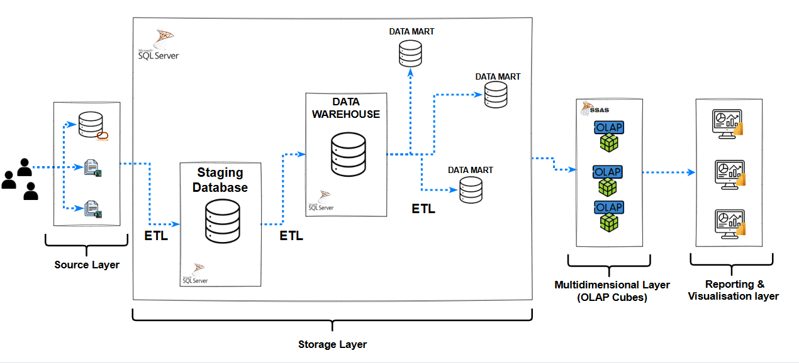
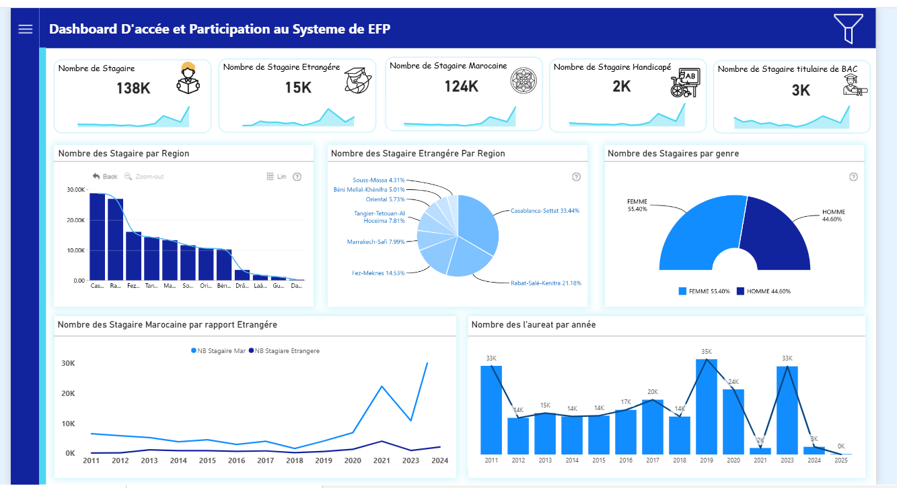
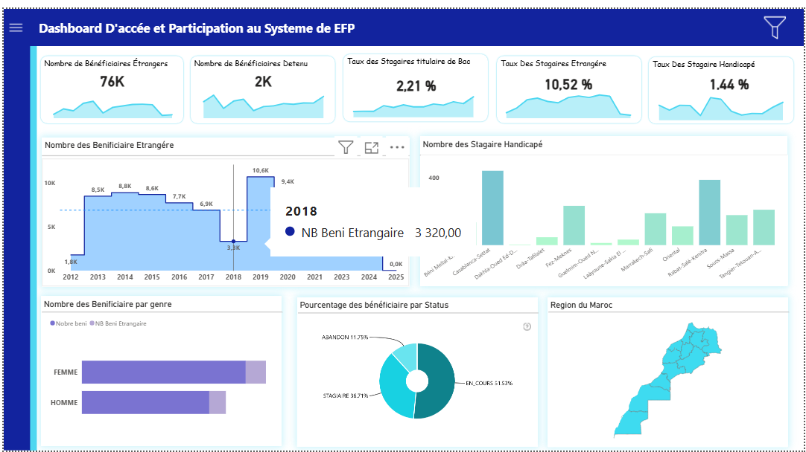
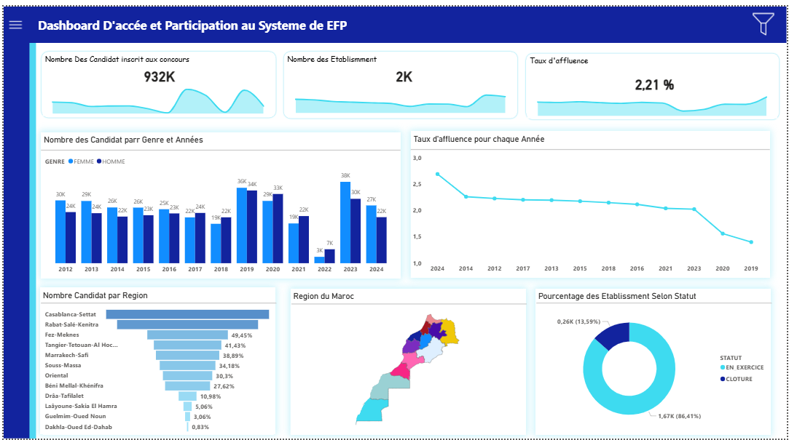
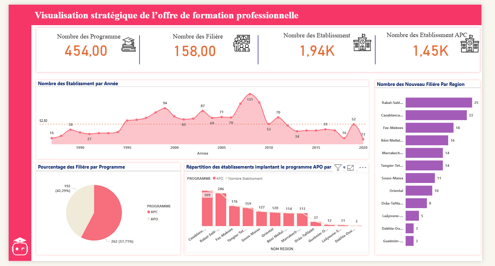
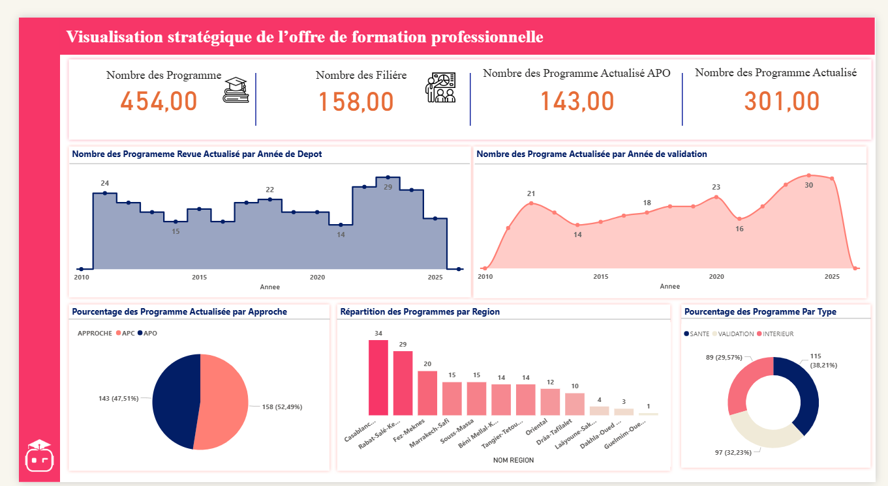

# 📊 Projet Business Intelligence – Formation Professionnelle au Maroc

---

## 📌 Résumé de Projet

Ce projet a pour objectif la mise en place d’une solution complète de **Business Intelligence (BI)** pour le secteur de la formation professionnelle au Maroc.  
La solution repose sur une architecture décisionnelle permettant de :  

- Centraliser et historiser les données dans un **Data Warehouse**.  
- Automatiser les flux grâce à des processus **ETL (SSIS)**.  
- Créer des **cubes OLAP (SSAS)** pour l’analyse multidimensionnelle.  
- Fournir des **tableaux de bord interactifs (Power BI Report Server)** afin de faciliter le suivi et la prise de décision.  

---

## 🏗️ Architecture de Projet

L’architecture décisionnelle repose sur plusieurs couches :  

- **Sources :** données issues de bases Oracle et fichiers Excel.  
- **Staging Database :** zone de préparation et nettoyage des données.  
- **Data Warehouse :** entrepôt centralisé pour l’historisation.  
- **Data Marts :** modèles spécifiques aux axes stratégiques.  
- **OLAP Cubes :** analyse multidimensionnelle via SSAS.  
- **Reporting :** restitution avec Power BI interactif.  

---

## 📊 Tableaux de bord Développés

### 🔹 Catégorie 2 – Accès et participation au système de formation professionnelle
Ces dashboards permettent de suivre :  
- L’évolution des inscriptions et participations aux établissements.  
- La répartition des candidats et bénéficiaires par région et par filière.  
- Les taux d’affluence et d’évolution selon différents filtres dynamiques.  

  
  
  

---

### 🔹 Catégorie 3 – Offre de formation professionnelle
Ces dashboards mettent en évidence :  
- La répartition des programmes de formation par région.  
- L’évolution et la disponibilité des filières de formation.  
- Des indicateurs globaux permettant de mesurer l’adéquation formation/emploi.  

  
  

---
## 🛠️ Technologies & Mots-clés

### 🔧 Technologies utilisées
- **Bases de données :** Oracle Database, Microsoft SQL Server  
- **ETL :** SQL Server Integration Services (SSIS)  
- **OLAP :** SQL Server Analysis Services (SSAS), requêtes MDX  
- **Visualisation :** Power BI Report Server  
- **Langages :** SQL, MDX  

### 🏷️ Mots-clés
`Business Intelligence` · `Data Warehouse` · `ETL` · `OLAP` · `Power BI` · `Formation Professionnelle` · `SSIS` · `SSAS` · `KPI` · `Tableaux de bord`  

---